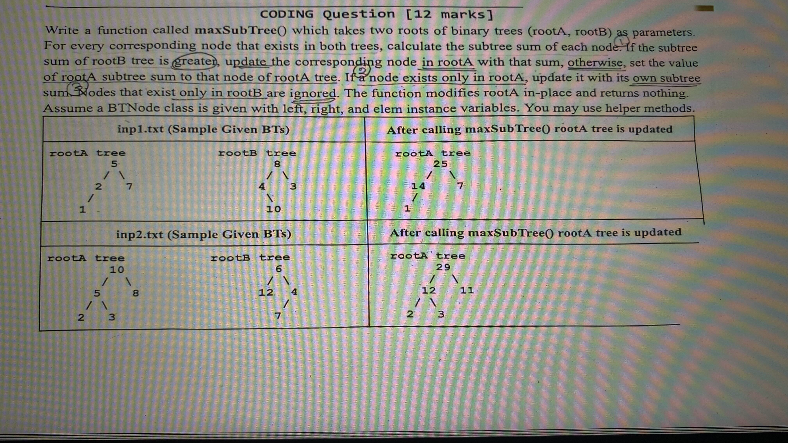

# `maxSubTree()`

## Problem



## What we need to do

We have two binary trees, A and B. We update the values in A using the
original subtree sums from both trees.

A subtree includes the current node and all its descendants. So its sum is:

```text
subtree sum = current value + left subtree sum + right subtree sum
```

Corresponding nodes means nodes at the same position. We compare root with
root, left child with left child, and right child with right child. Their
values don't need to match.

For each node in A:

1. If B has a node at the same position, use the larger subtree sum.
2. If B has no node there, use A's own subtree sum.
3. If a node exists only in B, don't copy it into A.

We only change A's values. Its shape stays the same, B stays unchanged, and
`maxSubTree()` returns nothing.

## Java solution

Assume `BTNode` is already given, with `left`, `right`, and an integer `elem`.

```java
static void maxSubTree(BTNode rootA, BTNode rootB) {
    if (rootA == null) {
        return;
    }

    // Calculate the sums before changing any values in this subtree
    int sumA = subtreeSum(rootA);

    if (rootB != null) {
        int sumB = subtreeSum(rootB);

        if (sumB > sumA) {
            rootA.elem = sumB;
        } else {
            rootA.elem = sumA;
        }

        maxSubTree(rootA.left, rootB.left);
        maxSubTree(rootA.right, rootB.right);
    } else {
        rootA.elem = sumA;

        maxSubTree(rootA.left, null);
        maxSubTree(rootA.right, null);
    }
}

static int subtreeSum(BTNode root) {
    if (root == null) {
        return 0;
    }

    return root.elem + subtreeSum(root.left) + subtreeSum(root.right);
}
```

## 1. Calculate a subtree sum

The helper adds the current node's value to the sums of its two children.
If a child is `null`, that side contributes `0`.

For this subtree:

```text
    5
   / \
  2   3
```

The sum is `5 + 2 + 3 = 10`. For a leaf, the subtree sum is just its own value.

`subtreeSum()` only reads the tree. It doesn't change any values.

## 2. Stop if A has no node

```java
if (rootA == null) {
    return;
}
```

We're updating existing nodes in A. If there's no node at this position,
there's nothing to update. We stop even if B has a node there.

That doesn't mean we remove that node from B's subtree sums. In sample 1,
B's `10` has no matching node in A, but it still contributes to the sums
of B's `4` and `8`.

## 3. Compare the sums before updating the children

```java
int sumA = subtreeSum(rootA);
```

At this point, the current node and its descendants still have their original
values. We calculate A's sum first. If B exists, we calculate its sum too and
store the larger one in `rootA.elem`.

Only then do we process the children.

This order matters. If we changed the children first and then summed A again,
we'd be adding their replacement values instead of their original values.

In sample 1, A originally sums to `5 + 2 + 7 + 1 = 15`. If we changed its left
child from `2` to `14` first, adding those values would give
`5 + 14 + 7 + 1 = 27`. That's not the original subtree sum.

Updating the parent first is safe here. When we later calculate a child's
subtree sum, that subtree doesn't include its parent. Its values are still
unchanged.

## 4. Move to matching positions

```java
maxSubTree(rootA.left, rootB.left);
maxSubTree(rootA.right, rootB.right);
```

We keep the same path in both trees. A left child is only compared with a left
child. We don't search elsewhere in B for a node with the same value.

If `rootB` is `null`, we store `sumA` and pass `null` for B when processing
both children. There's no matching B subtree below a missing node.

We handle this separately instead of treating a missing B node as a sum of
zero. If A's sum were negative, we would still need to keep A's own sum.

## Sample 1

The original trees are:

```text
Tree A             Tree B
    5                  8
   / \                / \
  2   7              4   3
 /                    \
1                     10
```

Using the original values:

| Position | A's subtree sum | B's subtree sum | New value in A |
| --- | --- | --- | --- |
| Root | `5 + 2 + 7 + 1 = 15` | `8 + 4 + 3 + 10 = 25` | `25` |
| Left | `2 + 1 = 3` | `4 + 10 = 14` | `14` |
| Right | `7` | `3` | `7` |
| Left → left | `1` | No node | `1` |

B's `10` is at left → right. A has no node there, so we don't create one.

The updated A is:

```text
    25
   /  \
  14   7
 /
1
```

## Sample 2

Using the original values from the image:

| Position | A's subtree sum | B's subtree sum | New value in A |
| --- | --- | --- | --- |
| Root | `10 + 5 + 8 + 2 + 3 = 28` | `6 + 12 + 4 + 7 = 29` | `29` |
| Left | `5 + 2 + 3 = 10` | `12` | `12` |
| Right | `8` | `4 + 7 = 11` | `11` |
| Left → left | `2` | No node | `2` |
| Left → right | `3` | No node | `3` |

B's `7` contributes to the right subtree sum of `11`, but we don't copy it
into A.

The updated A is:

```text
    29
   /  \
  12  11
 /  \
2    3
```

The new values are the answers for each original subtree. We don't sum the
updated tree again to decide the root's value.

## Complexity

This version keeps the recursion simple, but it calculates some subtree sums
more than once. A node can be counted again for each ancestor above it.

If A has `n` nodes and B has `m` nodes, a safe worst-case time bound is
`O((n + m)²)`. Long chains can cause quadratic work.

The recursion uses `O(hA + hB)` space, where `hA` and `hB` are the tree heights.
We don't create new tree nodes or change any child links.
