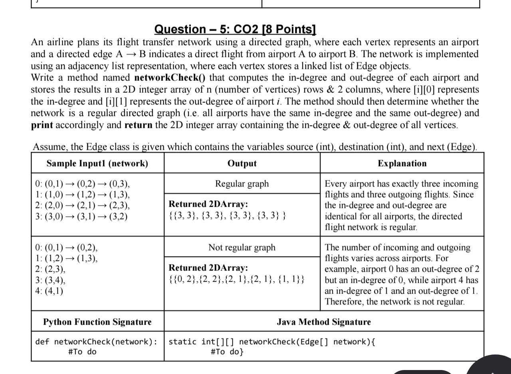

# `networkCheck()` — Airline Flight Network

## Problem



## Java solution

```java
static int[][] networkCheck(Edge[] network) {
    int n = network.length;
    int[][] degree = new int[n][2];

    // Count in-degree and out-degree
    for (int i = 0; i < n; i++) {
        Edge currentEdge = network[i];

        while (currentEdge != null) {
            // Edge leaves the source
            degree[currentEdge.source][1]++;

            // Edge enters the destination
            degree[currentEdge.destination][0]++;

            currentEdge = currentEdge.next;
        }
    }

    // Assume regular unless we find a mismatch
    boolean regular = true;

    for (int i = 1; i < n; i++) {
        if (degree[i][0] != degree[0][0] ||
            degree[i][1] != degree[0][1]) {
            regular = false;
            break;
        }
    }

    if (regular) {
        System.out.println("Regular graph");
    } else {
        System.out.println("Not regular graph");
    }

    return degree;
}
```

## Intuition

For every flight, we need to update two counts. If the flight is `0 → 2`, it
leaves airport `0` and enters airport `2`. So airport `0` gets one out-degree,
and airport `2` gets one in-degree.

We can count both while visiting the same edge. We don't need a separate
search for incoming flights.

Once we've counted all the edges, we check if every airport has the same
in-degree and the same out-degree.

## 1. Store the counts

```java
int n = network.length;
int[][] degree = new int[n][2];
```

`network` has one entry per airport, so its length gives us the number of
airports. We create one row per airport and use two columns:

| Entry | Meaning |
| --- | --- |
| `degree[i][0]` | In-degree of airport `i` |
| `degree[i][1]` | Out-degree of airport `i` |

Java fills the array with zeros. So every airport starts with `{0, 0}`.

## 2. Visit each edge

```java
for (int i = 0; i < n; i++) {
    Edge currentEdge = network[i];

    while (currentEdge != null) {
        degree[currentEdge.source][1]++;
        degree[currentEdge.destination][0]++;

        currentEdge = currentEdge.next;
    }
}
```

The `for` loop picks one airport's list. `currentEdge` starts at the first edge
in that list. The `while` loop processes that edge, then moves to the next one
using `currentEdge.next`.

For each edge, we add `1` to the source's out-degree and the destination's
in-degree. When `currentEdge` becomes `null`, we're done with that list.

If `network[i]` is already `null`, that airport has no outgoing edges. We skip
its list. It can still have incoming edges from other airports.

Let's trace this list:

```text
0: (0,1) → (0,2)
```

Assuming all counts are zero before we start:

| Edge processed | Airport 0 `{in, out}` | Airport 1 `{in, out}` | Airport 2 `{in, out}` |
| --- | --- | --- | --- |
| None | `{0, 0}` | `{0, 0}` | `{0, 0}` |
| `0 → 1` | `{0, 1}` | `{1, 0}` | `{0, 0}` |
| `0 → 2` | `{0, 2}` | `{1, 0}` | `{1, 0}` |

Airport `0` now has two outgoing edges. Airports `1` and `2` each have one
incoming edge.

We're only done with airport `0`'s list here. Another list can contain an edge
like `2 → 0`, which would increase airport `0`'s in-degree. So we need to finish
all the lists before checking if the graph is regular.

## 3. Compare the counts

```java
boolean regular = true;

for (int i = 1; i < n; i++) {
    if (degree[i][0] != degree[0][0] ||
        degree[i][1] != degree[0][1]) {
        regular = false;
        break;
    }
}
```

We assume the graph is regular until we find a mismatch.

We use airport `0` for comparison. If every airport has the same counts as
airport `0`, they all have the same counts as each other. There's no need to
compare every possible pair.

The loop starts at `1` because airport `0` would always match itself.

The first condition checks the in-degree. The second checks the out-degree.
We use `||` because a mismatch in either one is enough to make the graph
not regular.

In sample 2, airport `0` has `{0, 2}` and airport `1` has `{2, 2}`. Their
out-degrees match, but their in-degrees don't. So we set `regular` to `false`
and stop the comparison with `break`.

We need to compare in-degrees across airports, and out-degrees across airports.
Checking whether each airport's own in-degree equals its out-degree isn't
enough. For example, `{1, 1}` and `{2, 2}` both have equal values within their
rows, but the rows don't match.

## 4. Print and return

```java
if (regular) {
    System.out.println("Regular graph");
} else {
    System.out.println("Not regular graph");
}

return degree;
```

We print the result based on `regular`, then return the counts.

The earlier `break` only stops the comparison. It doesn't leave the degree
array incomplete because we've already counted all the edges.

## Complexity

The outer loop visits `V` airports. Across all the lists, the inner loop visits
`E` edges in total. Nested loops don't automatically mean `O(V²)` here; each
edge is processed only once.

Counting takes `O(V + E)`, and comparing takes at most `O(V)`. So the total
time is `O(V + E)`.

The returned array takes `O(V)` space. The other variables take `O(1)` space.
