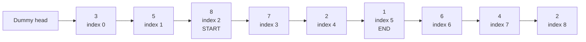
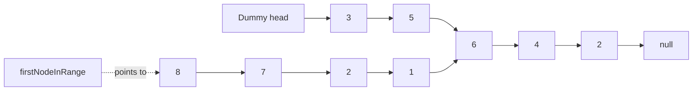
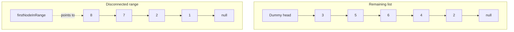
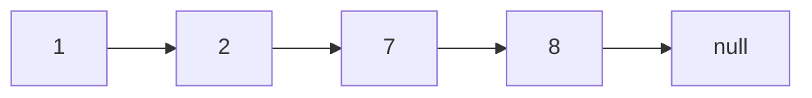
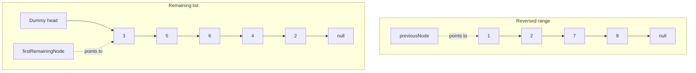
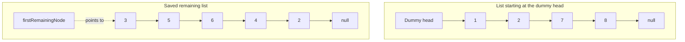
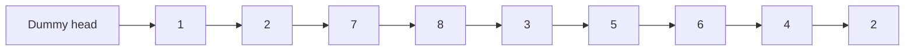

# `rangeReverse()` — Step-by-Step Diagram

Example:

```text
start = 2, end = 5
```

The numbers under the values are their original indices.

## Step 1: Find the range

The range starts at index `2` and ends at index `5`.



`nodeBeforeStart` points to `5`, `firstNodeInRange` points to `8`, and
`lastNodeInRange` points to `1`.

## Step 2: Disconnect the range

This happens in two small parts.

### Step 2A: Make the main list skip the range

Here, `nodeBeforeStart` is node `5` and `nodeAfterEnd` is node `6`.

```java
nodeBeforeStart.next = nodeAfterEnd;
```

After this line, the arrow from `5` to `8` is replaced by an arrow from `5` to
`6`. The main list now skips the selected range:



The selected nodes are not completely disconnected yet. Node `1` still points
to node `6`.

### Step 2B: Disconnect the end of the range

```java
lastNodeInRange.next = null;
```

After this line, node `1` points to `null`. Now the selected range and the
remaining list are separate:



## Step 3: Reverse the disconnected range

Each node is pointed toward the node before it.



After reversal, `previousNode` points to `1`, the first reversed node.
`firstNodeInRange` still points to `8`, which is now the last reversed node.

## Step 4: Put the reversed range after the dummy head

This also happens one line at a time.

### Step 4A: Save the beginning of the remaining list

```java
Node firstRemainingNode = dHead.next;
```

This line does not change any arrows. It makes `firstRemainingNode` point to
node `3`, so we can still find the remaining list after changing `dHead.next`.



### Step 4B: Make the dummy head point to the reversed range

```java
dHead.next = previousNode;
```

After this line, the reversed range is at the front. The remaining nodes are
temporarily separate, but `firstRemainingNode` still points to node `3`.



### Step 4C: Join the two parts

```java
firstNodeInRange.next = firstRemainingNode;
```

After this line, node `8` points to node `3`. The full list is connected:



No new node is created. The method only changes the `next` links of the
existing nodes.
