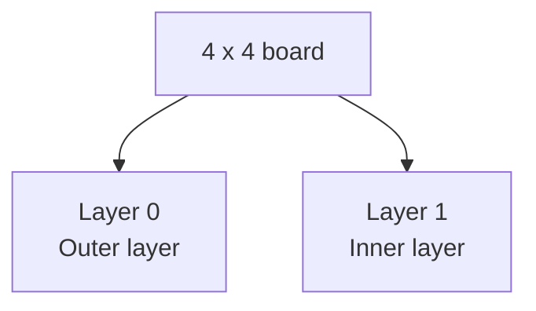

# `rotateSecret()` — Step-by-Step Diagram

Example:

```text
T A U S
A R I .
D T T N
S C F U
```

The board is `4 x 4`, so it has two layers:

- The inner `2 x 2` layer rotates clockwise `1` time.
- The outer `4 x 4` layer rotates clockwise `2` times.

## Step 1: Find the number of layers

The size of the board is `4`, so:

```java
int totalLayers = board.length / 2;
```

```text
totalLayers = 4 / 2
totalLayers = 2
```

The outer layer has index `0`, and the inner layer has index `1`.



## Step 2: Start from the innermost layer

The loop starts at `totalLayers - 1`, which is layer `1`.

```java
int rotations = 1;

for (int layer = totalLayers - 1; layer >= 0; layer--) {
    // Rotate the current layer
    rotations++;
}
```

This gives each layer the correct number of rotations:

```text
Layer 1 (inner) -> 1 rotation
Layer 0 (outer) -> 2 rotations
```

## Step 3: Rotate one layer clockwise

One clockwise rotation is completed by moving the four sides one at a time.


### Step 3A: Save the top-left value

The top-left value would be overwritten when the left side moves, so it is
saved in a temporary variable.

```java
char temporary = board[layer][layer];
```

Only one character is saved. No new array is created.

### Step 3B: Move the left side upward

```java
for (int row = layer; row < last; row++) {
    board[row][layer] = board[row + 1][layer];
}
```

### Step 3C: Move the bottom side to the left

```java
for (int column = layer; column < last; column++) {
    board[last][column] = board[last][column + 1];
}
```

### Step 3D: Move the right side downward

```java
for (int row = last; row > layer; row--) {
    board[row][last] = board[row - 1][last];
}
```

### Step 3E: Move the top side to the right

```java
for (int column = last; column > layer + 1; column--) {
    board[layer][column] = board[layer][column - 1];
}
```

### Step 3F: Place the saved value

The saved top-left value moves one position to the right.

```java
board[layer][layer + 1] = temporary;
```

## Step 4: Rotate the inner layer once

Before rotating the inner layer:

```text
T A U S
A R I .
D T T N
S C F U
```

The inner layer is:

```text
R I
T T
```

After one clockwise rotation:

```text
T R
T I
```

The complete board is now:

```text
T A U S
A T R .
D T I N
S C F U
```

## Step 5: Rotate the outer layer twice

After the first outer-layer rotation:

```text
A T A U
D T R S
S T I .
C F U N
```

After the second outer-layer rotation:

```text
D A T A
S T R U
C T I S
F U N .
```

## Step 6: Print the recovered message

The characters are printed row by row:

```java
for (int row = 0; row < board.length; row++) {
    for (int column = 0; column < board.length; column++) {
        System.out.print(board[row][column]);
    }
}
```

Output:

```text
DATASTRUCTISFUN.
```

## Complete Solution

```java
public class RotateSecret {
    public static void rotateSecret(char[][] board) {
        int totalLayers = board.length / 2;
        int rotations = 1;

        // Start from the innermost layer
        for (int layer = totalLayers - 1; layer >= 0; layer--) {
            for (int count = 0; count < rotations; count++) {
                rotateOneTime(board, layer);
            }

            rotations++;
        }

        // Print the recovered message
        for (int row = 0; row < board.length; row++) {
            for (int column = 0; column < board.length; column++) {
                System.out.print(board[row][column]);
            }
        }

        System.out.println();
    }

    public static void rotateOneTime(char[][] board, int layer) {
        int last = board.length - 1 - layer;

        // Save the top-left value
        char temporary = board[layer][layer];

        // Move the left side upward
        for (int row = layer; row < last; row++) {
            board[row][layer] = board[row + 1][layer];
        }

        // Move the bottom side to the left
        for (int column = layer; column < last; column++) {
            board[last][column] = board[last][column + 1];
        }

        // Move the right side downward
        for (int row = last; row > layer; row--) {
            board[row][last] = board[row - 1][last];
        }

        // Move the top side to the right
        for (int column = last; column > layer + 1; column--) {
            board[layer][column] = board[layer][column - 1];
        }

        // Put the saved value in its new position
        board[layer][layer + 1] = temporary;
    }

    public static void main(String[] args) {
        char[][] board = {
                {'T', 'A', 'U', 'S'},
                {'A', 'R', 'I', '.'},
                {'D', 'T', 'T', 'N'},
                {'S', 'C', 'F', 'U'}
        };

        rotateSecret(board);
    }
}
```

The method changes the original board directly. It only uses a few integer
variables and one temporary character, so its extra space complexity is
`O(1)`.
